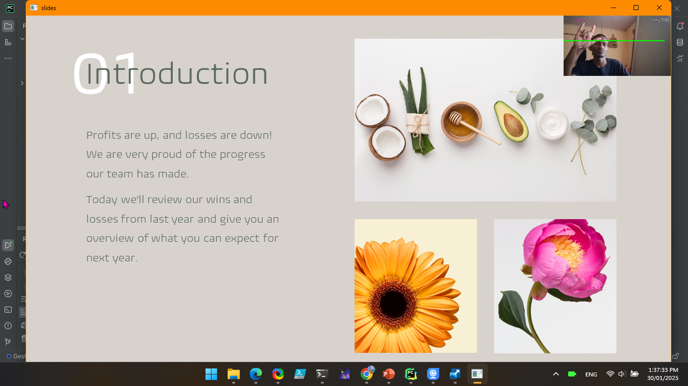

# Gesture-Controlled Presentation Slides

This project utilizes the MediaPipe library to enable users to control presentation slides using hand gestures for a touchless and interactive experience. Key features include gesture recognition and customizable settings. Simply install MediaPipe, calibrate the system, and use gestures like swiping to navigate through slides, which are converted to images and fed to the program.

## Table of Contents
1. [Final Result Illustration](#final-result-illustration)
2. [Features](#features)
3. [How It Works](#how-it-works)
4. [Requirements](#requirements)
5. [Getting Started](#getting-started)
6. [Cloning the Repository](#cloning-the-repository)
7. [Contributing](#contributing)
8. [License](#license)

## Final Result Illustration

  

<em>Figure 1: Demonstration of the gesture-controlled presentation in action.</em>

## Features

- **Gesture Recognition:** Detects and interprets hand gestures to navigate through presentation slides.
- **Touchless Control:** Allows presenters to control their slides without physical contact, enhancing hygiene and convenience.
- **User-Friendly Interface:** Easy-to-use interface with clear instructions for setting up and using gesture controls.
- **Customization:** Offers customizable gesture settings to suit individual preferences.

## How It Works

1. **Setup:** Install the required MediaPipe library and connect a webcam or gesture recognition device to your computer.
2. **Distance:** make sure you are not too for or too near the webcam.
3. **Control:** Use predefined hand gestures to navigate through your presentation slides:
   - Raise right thumb to go to the previous slide.
   - Raisse right small finger to advance to the next slide.
   - Raise imde and middle finder for pointer.
   - Raise your index finger to draw onthe slides.

## Requirements

- **Python Version:** The project is developed using Python 3.9, but it should work with any version from Python 3.7 to 3.9.
- **IDE:** Pycharm was used for development, but any suitable IDE such as VS Code can be used.

## Getting Started

To get started, follow these steps to install the required libraries: first open termianl and run the following commands,,
1. `pip install opencv-python`
2. `pip install cvzone`
3. `pip install mediapipe`
## Cloning the Repository
To clone the repository, use the following command `git clone https://github.com/sployal/Guesture_presentation_python`.

## Contributing
We welcome contributions! Please read our Contributing Guidelines for more details on how to get involved.
